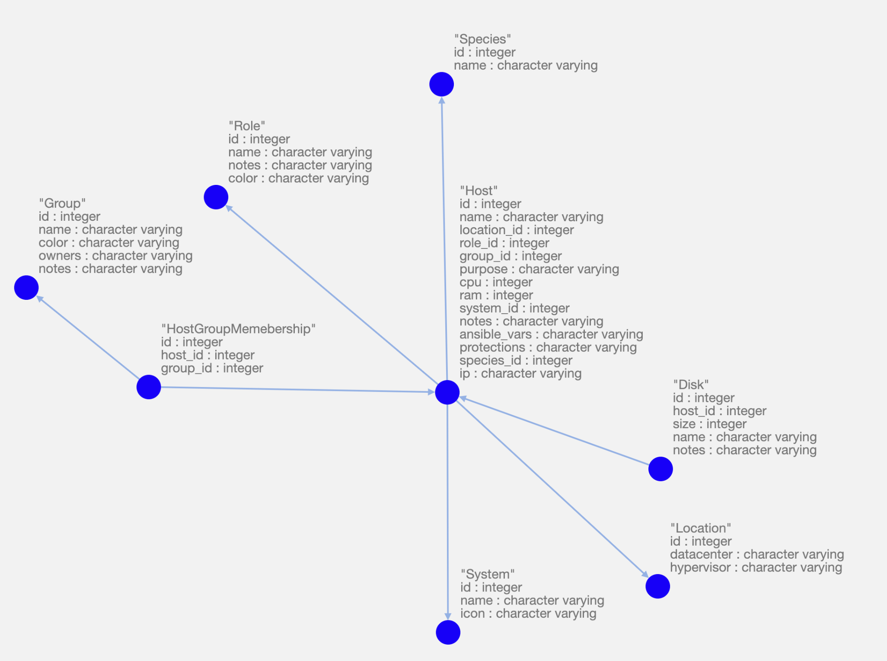

# SimpleMachineInventory

## deploy

### prerequisites
* POSIX compatible system
* python3.7+
* some reverse proxy for covering up auth and access control
* `pip3 install -r requirements.txt`


## usage 
### managing hosts and disks

via web-gui at `/SimpleMachineInventory/`

to write changes you must auth using "login" button and be listed in db as writer

### managing locations, roles, groups, systems and accessing data programatically

via API at `/SimpleMachineInventory/api/` - there's swagger or you can use postman

### accessing ansible inventory

via `/SimpleMachineInventory/ansible/list` and `/SimpleMachineInventory/ansible/host/<hostname>` - see https://docs.ansible.com/ansible/latest/dev_guide/developing_inventory.html#developing-inventory-scripts

#### example helper script

```
#!/usr/bin/python3
server='http://<IP>:5000'
import requests,sys

try:
  if len(sys.argv)==2 and sys.argv[1]=='--list':
    r = requests.get(server+'/ansible/list')
    if r.status_code!=200:
      raise Exception('api broken')
    print(r.json())
  elif len(sys.argv)==3 and sys.argv[1]=='--host':
    r = requests.get(server+'/ansible/host/'+sys.argv[2])
    if r.status_code!=200:
      raise Exception('no such host')
    print(r.json())
  else:
  	raise Exception('wrong syntax')
except Exception as e:
  print('{"error":"'+str(e)+'"}')
```

## DB schema

